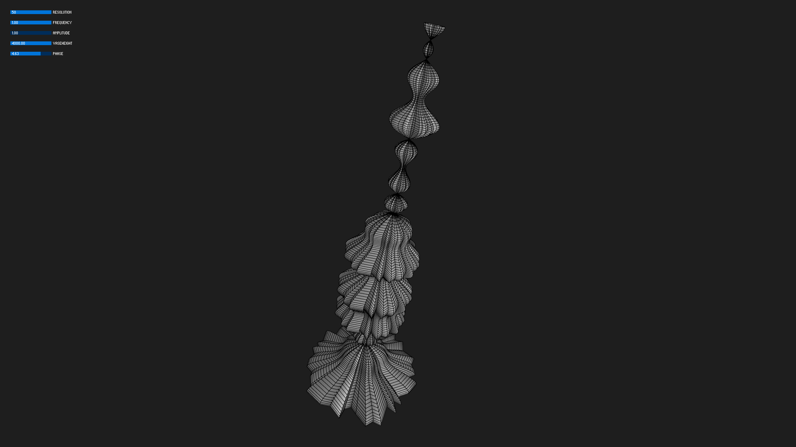
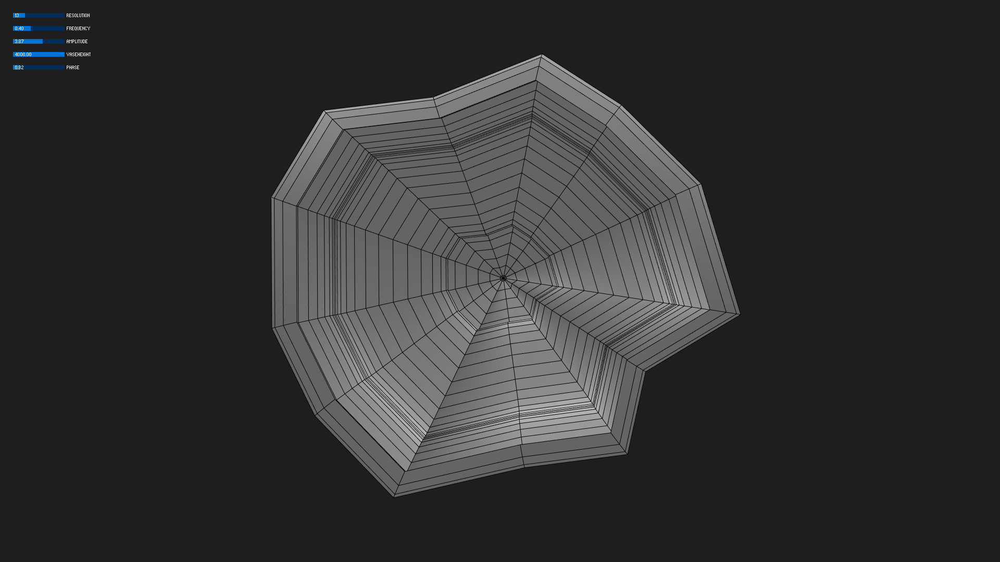
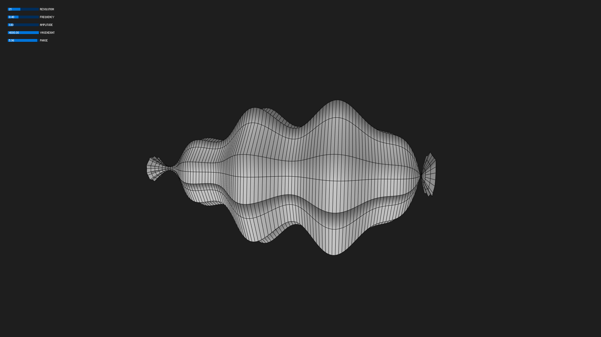

I started off with manipulating the code example. I added free mouse navigation in 3-dimensional space with PeasyCam library, introduced multiple sine waves, and modulated the radius of vertices. The frequency control now controls the base frequency. 

